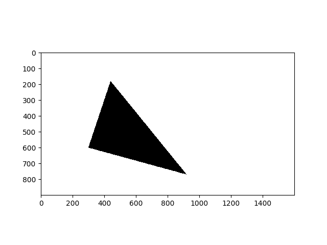

[](https://www.gnu.org/licenses/gpl-3.0.en.html)
[](https://github.com/mikecokina/trast)
[](https://www.python.org/)
[](https://en.wikipedia.org/wiki/Operating_system)

# TRAST - Triangle - RASTerization
Python implementation of triangle rasterization in computer graphic. Rasterize trinagle/s defined by in 2D plane 
via 3 simple points on supplied screen size.

Usage:

```python
from trast import Rasterizer

t = [[300, 300],
     [920, 130],
     [440, 720]]

r = Rasterizer(screen=(1600, 900), pixel=255)
r.rasterize_triangle(face=t)
r.quick_plot()
```

Rasterized screen is accessible as following:

```
screen = r.raster
```

Depicted result from above


